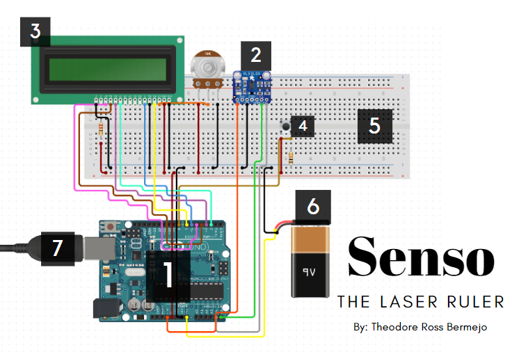

# ***Senso***

> - HCI Theoretical Paper Proposal: Senso - Laser Ruler an Arduino Project (2023)

## ***Materials***

Arduino Uno (Board)

Adafruit VL53L0X Time of Flight 
Distance Sensor

LCD 16x2

Mini Pushbutton Switch

Breadboard

9V Alkaline Battery

USB Cable A to B - 6 Foot (Optional)

# Senso: Final Functional Model

.png>)

# Senso: Flowchart Process

.png>)

